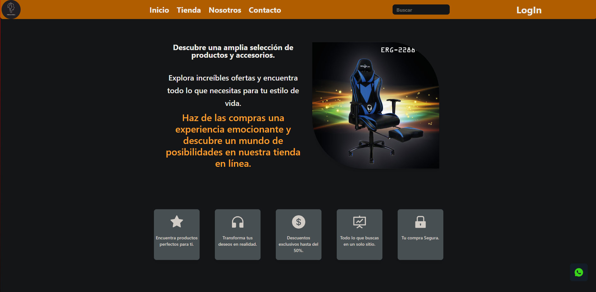

<h1 align="center">  Hola, Soy Leonel Aguilera </h1>

<h3 align="center">Full Stack Developer </h3>

## Un poco sobre mi :  

- 👨‍💻 Actualmente estoy adquiriendo nuevas tecnologías para añadir a mis habilidades y aplicarlas en proyectos personales. Teniendo como objetivo es seguir las buenas prácticas para lograr un código eficiente y escalable.

- 📚 Aspiro a forjar mi camino como un solucionador proactivo, distinguiéndome en el ámbito de la atención al cliente al enfrentar desafíos con destreza y al brindar soluciones óptimas.

- 💪🏼 Futuras Metas: Aprender mas sobre diseño, UX, UI - Ser un desarrollador Senior 😎

- ⚡ Hobbies: Gimnasio - Libros - Aprender - Codear - Amigos.

<h3 align="left">Tecnologias:</h3>

   
 </a>     
  
  
  
 

<h3> Portafolio </h3> <a href="https://github.com/Leonel42aguil/Portafolio-nuevo" target="_blank">Check code</a>

 Mi Portafolio web donde muestro mis proyectos y toda informacion sobre mi.
 

 
  

<h3 align="left">Proyectos:</h3>

<h3> Perisferia ! </h3> <a href="https://github.com/Leonel42aguil/Perisferia-Store" target="_blank">Check code</a>

 Aplicacion Web para Potencia tu setup gamer o laboral, encuentra accesorios tecnológicos de primer nivel y eleva tu experiencia al máximo.  
Las tecnologias utilizadas fueron : React, Tailwind Css, Express, Node.js, JavaScript, Supabase. 
En mi responsabilidad : Mas que todo en Front-End, partes de Back-end, entre otros...

 
  

<h3> AppDogs </h3> 
<a href="https://github.com/Leonel42aguil/App-Dogs" target="_blank">Check code</a>

 Aplicacion web donde podes encontrar informacion de todos las razas de perros y tambien la oportunidad de poder de crear una raza simular .

 

  

<h3> App-Clima </h3> <a href="https://github.com/Leonel42aguil/AppClima">Check code</a>

 Experimenta con nuestra Aplicación Web de pronóstico climático en tiempo real. Desarrollada en tan solo 1-2 días, utilizamos React y CSS para brindarte información precisa de múltiples ciudades en todo el mundo.  

 
  

## Contactame para mas info
- Linkedin: https://www.linkedin.com/in/leonelchatard/ 📥
- Gmail: leonelcarp142nuevo@gmail.com 📧
- Portafolio: https://portafolio-nuevo-one.vercel.app/

